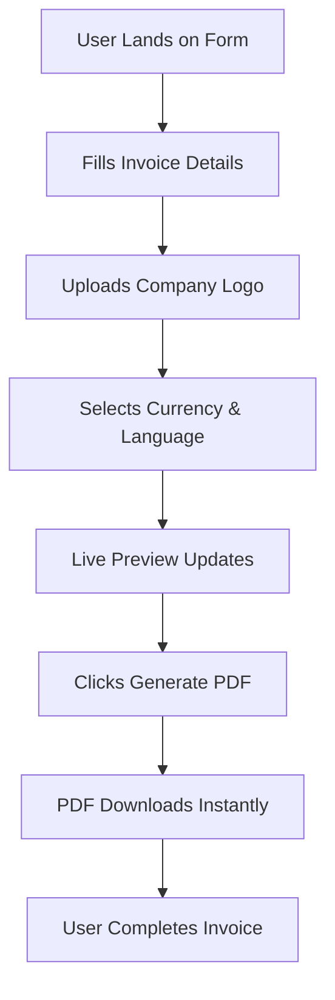

# Quota Invoice — Instant Invoice Generator

## Project Context
This is a web application. Small business owners and freelancers waste 20-30 minutes per invoice manually formatting documents in Word or Google Docs, often missing required legal fields that can invalidate payments or create compliance issues. Current invoice generators require account creation, store sensitive client data on third-party servers, or produce unprofessional-looking outputs that hurt credibility. Most tools also lack multi-currency support and international tax compliance, forcing users to research legal requirements manually or risk invalid invoices that delay payment.

Target user: people who want to invoice

## Tech Stack
- **Frontend:** Next.js
- **Styling:** Tailwind CSS, shadcn/ui
- **Hosting / Deploy:** Vercel

## User Flow (happy path)
1. User lands on Quota Invoice homepage with form fields visible
2. User fills invoice details: company info, client info, line items, currency selection
3. User uploads logo image and selects language from dropdown
4. User clicks Generate Invoice and sees live PDF preview
5. User downloads professional PDF invoice instantly

## UI Guidelines
- Overall Style: Clean minimal design with abundant white space, focusing on typography hierarchy and form clarity. Single-column layout on mobile, two-column (form + preview) on desktop. No shadows, gradients, or decorative elements.
- Color Palette: Primary purple #8B5CF6 for main CTAs, darker #6D28D9 for hover states, deepest #4C1D95 for focus rings. White background #FFFFFF, light gray #F8FAFC for form sections, dark gray #1F2937 for text, red #EF4444 for validation errors.
- Typography: Inter font family throughout. Headings use font-semibold (600), body text font-normal (400). Form labels 14px text-sm, input text 16px text-base, validation errors 12px text-xs. Proper contrast ratio 4.5:1 minimum.
- Layout Pattern: Full-width responsive design with max-width-4xl container. Top navigation bar reserved for Google Ads (728x90). Left and right sidebars (300px each) for ads on desktop, collapse on mobile. Form centered with 24px padding.
- Key Components: shadcn/ui Input, Select, Button (default variant), Label components. Cards with subtle border-gray-200 borders. File upload dropzone with dashed border and hover states. PDF preview container with 1:1.414 aspect ratio.
- Micro-interactions: 150ms ease-in-out transitions on button hovers and focus states. Form validation appears immediately on blur with slide-down animation. Loading skeleton during PDF generation with subtle pulse animation.
- Accessibility: Focus rings visible on all interactive elements, minimum 44px touch targets on mobile, proper heading hierarchy (h1 for page title, h2 for sections), alt text on logo uploads, screen reader labels on form fields.

## Implementation Tasks
Build the following features. Start with P0, then P1, then P2.

### P0: Invoice Form Builder
User fills a single-page form with company details, client information, line items with quantities and prices, tax rates, and currency selection. Form auto-calculates totals including subtotal, tax, and final amount with zero calculation errors. Supports 170+ currencies with real-time formatting and 50+ languages for field labels.
- **Acceptance:** User can complete an invoice in under 60 seconds with all required fields validated in real-time. Currency formatting updates immediately on selection (USD shows $1,234.56, EUR shows €1.234,56). Math calculations are accurate to 2 decimal places with no rounding errors across all currencies.
- **How to build:** Build controlled form with shadcn/ui components and Zod validation. Use Intl.NumberFormat for currency display and dinero.js for precise decimal arithmetic. Store currency data locally via static JSON import with ISO 4217 codes.

### P0: PDF Generation Engine
User generates professional PDF invoice instantly with company logo, proper legal formatting, and international compliance fields. PDF includes required tax information, payment terms, and due dates formatted according to selected country's invoice standards. Layout is clean, printable, and includes space for digital signatures.
- **Acceptance:** PDF generates within 2 seconds on form submission with no server upload required. Invoice includes all legally required fields for top 10 business countries (US, UK, Germany, France, Canada, Australia, Netherlands, Sweden, Norway, Denmark). Logo appears crisp at 150 DPI minimum.
- **How to build:** Use @react-pdf/renderer to generate PDFs client-side in Next.js. Create responsive templates with conditional fields based on selected country/region. Handle logo upload via FileReader API with automatic resize to 200x80px max.

### P1: Live Invoice Preview
User sees real-time preview of invoice design as they type, with immediate visual feedback on formatting, calculations, and layout. Preview updates instantly when currency, language, or country changes. Shows exactly how the final PDF will appear with proper spacing and typography.
- **Acceptance:** Preview renders within 300ms of any form field change using Next.js client-side updates. Visual preview matches final PDF output exactly including fonts, spacing, and logo placement. Form validation errors appear inline with red text immediately on blur.
- **How to build:** Build preview component using same @react-pdf/renderer templates as PDF generation. Use React state with debounced updates (300ms) to prevent excessive re-renders. Share identical styling between preview and final output.

### P1: Logo Upload Handler
User drags and drops or selects company logo image that appears correctly positioned and sized on the invoice. Supports PNG, JPG, and SVG formats with automatic compression and optimization. Logo placement follows professional invoice design standards with proper margins and scaling.
- **Acceptance:** Logo uploads process within 1 second and display at correct aspect ratio without pixelation. File size is automatically compressed to under 100KB while maintaining visual quality. Drag-and-drop area provides clear visual feedback during hover and drop states.
- **How to build:** Use HTML5 File API with drag-and-drop zone built in shadcn/ui. Compress images using browser-native Canvas API to reduce file size. Validate file types and show preview using createObjectURL before adding to invoice.

### P2: Multi-Language Support
User selects from 50+ languages to localize all invoice field labels, terms, and formatting. Invoice automatically adjusts text direction for RTL languages and uses proper date/number formats for each locale. Language selection updates all UI elements and generated invoice content simultaneously.
- **Acceptance:** Language switching updates all form labels and PDF content within 200ms using Next.js client-side rendering. RTL languages (Arabic, Hebrew) display correctly with proper text alignment. Date formats follow locale conventions (MM/DD/YYYY for US, DD/MM/YYYY for UK).
- **How to build:** Use next-intl for internationalization with static JSON translation files. Load translations client-side and use Intl.DateTimeFormat for locale-specific date rendering. Support RTL with Tailwind CSS direction utilities.

## Technical Pipeline
1. User input captured through shadcn/ui form components with Zod schema validation — real-time field validation with error display
2. Form data processed by dinero.js calculation engine — converts all amounts to currency-agnostic integers, performs arithmetic, formats back to currency strings
3. Logo file processed via HTML5 File API — drag/drop handling, file type validation, Canvas API compression to under 100KB
4. @react-pdf/renderer generates PDF document client-side — uses form data + logo to create professional invoice layout with legal compliance fields
5. Internationalization handled by next-intl — loads appropriate translation JSON, applies RTL/LTR text direction, formats dates/numbers per locale
6. PDF delivered via browser download API — triggers file download without server round-trip or temporary storage

## Key Technical Challenges
- Decimal precision in multi-currency calculations: JavaScript floating-point arithmetic causes rounding errors that invalidate invoices. Mitigation: use dinero.js to convert all amounts to integers during calculation, then format back to currency strings only for display.
- PDF font rendering consistency across browsers: @react-pdf/renderer may render fonts differently on Safari vs Chrome, affecting invoice professionalism. Mitigation: embed web-safe fonts explicitly and test PDF output on major browsers during development.
- File size optimization with logo uploads: Large images can bloat PDF files and slow generation. Mitigation: use Canvas API to compress uploads to 100KB max while maintaining aspect ratio, and provide real-time file size feedback to users.
- RTL language layout in PDF generation: Arabic/Hebrew text direction may break invoice formatting since @react-pdf/renderer RTL support is limited. Mitigation: create separate PDF templates for RTL languages with proper text alignment and layout mirroring.

## Tech Rationale
- @react-pdf/renderer over jsPDF: provides React component-based PDF generation that matches our Next.js architecture, better template reusability, and built-in layout system vs manual positioning in jsPDF.
- dinero.js over native JavaScript math: prevents floating-point precision errors in currency calculations which are unacceptable for financial documents — stores amounts as integers internally.
- next-intl over react-i18next: integrates natively with Next.js App Router, provides better TypeScript support for translation keys, and handles locale-specific number/date formatting automatically.
- Client-side processing over server API: eliminates data privacy concerns (no sensitive business info stored), reduces infrastructure costs, and provides instant PDF generation without network latency.

## Build Order
1. Set up Next.js app with Tailwind CSS and shadcn/ui components — configure Vercel deployment, install @react-pdf/renderer. Done when homepage renders with basic form layout.
2. Build invoice form with Zod validation — create controlled inputs for company/client info, line items, currency dropdown. Done when form accepts input and shows real-time validation errors.
3. Implement precise calculation engine — use dinero.js for decimal arithmetic, Intl.NumberFormat for display. Done when line items auto-calculate totals without rounding errors across currencies.
4. Create PDF generation system — build @react-pdf/renderer templates with logo support, legal compliance fields. Done when form submission downloads properly formatted PDF.
5. Add logo upload with compression — File API drag-and-drop, Canvas resizing to 100KB max. Done when uploaded logos appear crisp in both preview and PDF output.
6. Build live preview component — mirror PDF template with real-time form updates, 300ms debounced rendering. Done when preview exactly matches final PDF layout.
7. Integrate internationalization — next-intl setup with 50+ language files, RTL support, locale-specific formatting. Done when language switching updates all content instantly.
8. Add Google Ads placeholders — reserve header, left, right sidebar space with responsive Tailwind classes. Done when ad zones are clearly marked and don't interfere with form usability.

## Suggested File Structure
- `app/page.tsx`
- `app/globals.css`
- `components/InvoiceForm.tsx`
- `components/InvoicePreview.tsx`
- `components/PDFDocument.tsx`
- `components/LogoUpload.tsx`
- `lib/calculations.ts`
- `lib/currencies.ts`
- `lib/validations.ts`
- `messages/en.json`

## Architecture Diagram

## Scope Boundaries
Do NOT build:
- User accounts or invoice history storage
- Payment processing or online payment links
- Invoice templates beyond professional business style
- Complex tax calculations (VAT, multi-tier, jurisdiction-specific)
- Email sending or client notifications
- Invoice numbering or sequence management
- Multi-page invoices or itemized service descriptions
- Integration with accounting software or APIs

## Assumptions
- Assumed PDF generation happens entirely client-side with no server processing — revisit if file size limits or processing performance become issues
- Assumed basic tax calculation (percentage-based) covers most use cases — revisit if users need complex multi-tier tax systems or VAT handling
- Assumed 170 currencies and 50 languages covers global needs — revisit if specific regional requirements emerge
- Assumed Google Ads integration uses standard display units — revisit if ad performance requires custom placements or formats

## Success Metrics
- Invoice completion rate: 80%+ of users who start filling the form successfully download a PDF
- Time to invoice generation: 90%+ of invoices generated within 90 seconds from first page load
- Calculation accuracy: Zero reported math errors across all supported currencies in user feedback